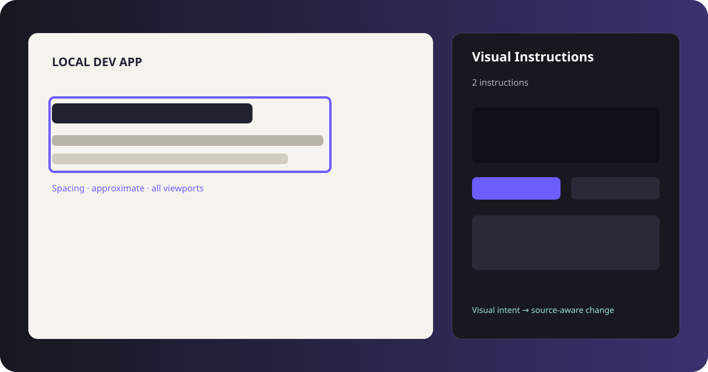

# Codex Visual Instructions

A local-first visual instruction layer for Codex: shape a desired UI in the browser, attach intent, and expose the complete review session as Site Tools (WebMCP).

> This tool is designed primarily for local development environments where Codex has access to the corresponding project source code.

> Browser edits are visual specifications. They are not intended to be copied literally into source code.

The package is framework-neutral and only starts when your application explicitly calls `install()`. It sends no telemetry, calls no external API, uses no cloud storage, and asks for no broad browser permissions.



## Why

“Move this heading a little right” mixes a visual outcome with an implementation guess. Codex Visual Instructions stores the temporary visual delta separately from the reason, precision, viewport, and scope. Codex can then inspect the real project and choose an appropriate layout or component change.

## Quick start

The package is prepared for npm publication but is not published yet. During local development, build it and install it from the repository path:

```bash
pnpm install
pnpm build
```

With Vite:

```ts
if (import.meta.env.DEV) {
  import("codex-visual-instructions").then(({ install }) => {
    const review = install();
    // review.destroy() removes listeners, tools, preview state, and the overlay.
  });
}
```

For a vanilla page, load the ESM build from your dev server and call `install()` explicitly. See [examples/vanilla](examples/vanilla) and [examples/react-vite](examples/react-vite).

## Review workflow

1. Start Review Mode from the floating control.
2. Click an element; Shift-click to build a multi-selection.
3. Drag, resize, nudge, replace text, hide, or preview removal.
4. Attach an intent category, comment, precision, and viewport scope.
5. Select **Confirm instructions for Codex** to mark the session ready.
6. Ask Codex to implement the current visual review session.
7. Codex reads the Site Tools payload, investigates source, implements compatible instructions together, reloads, verifies, and marks completed items resolved.

Visual instructions start as `draft`. **Confirm instructions for Codex** marks a session with unresolved instructions as `ready` and records `confirmedAt`; it does not send an HTTP request or contact an external API. A specification-changing edit returns the session to `draft` and clears `confirmedAt`, while panel, locale, and comparison-view changes do not. Sessions with no pending instructions cannot be confirmed. The payload summary reports `total`, `pending`, `resolved`, and operation counts across all instructions.

The browser preview is a visual specification, not a literal source patch. Codex must inspect the real project structure and implement the intent using its existing layout, components, tokens, and responsive conventions. The tool deliberately does not attempt DOM-to-React/Vue/Svelte source mapping.

## Site Tools (WebMCP)

When `document.modelContext.registerTool` is available in a top-level page, the overlay registers:

- `visual_review_get_session` (read only)
- `visual_review_list_instructions` (read only)
- `visual_review_get_instruction` (read only)
- `visual_review_mark_resolved`
- `visual_review_clear_session`

`visual_review_get_session` includes the session's `status`, optional `confirmedAt`, operation `summary`, and annotations so Codex can respect the explicit handoff boundary. Codex implements only instructions where `resolved` is `false`.

This follows the current JavaScript registration approach in the [official OpenAI Site Tools documentation](https://developers.openai.com/codex/webmcp). The built-in browser currently discovers JavaScript-registered tools only from the top-level page, not iframes. Availability depends on the Codex/ChatGPT app, model, workspace, and rollout.

## Keyboard shortcuts

| Action | Default |
| --- | --- |
| Toggle review | `Alt+Shift+R` |
| Parent / first child / previous / next sibling | `Alt+Shift+Arrow` |
| Nudge | `Arrow` (1 px visual delta) |
| Large nudge | `Shift+Arrow` (10 px visual delta) |
| Next compare mode | `Alt+Shift+C` |
| Cancel / clear selection | `Escape` |

Command IDs are independent from shortcut bindings. Pass project configuration through `install({ config })`; local locale preferences are kept in localStorage. The tracked [.codex-visual-review.json](.codex-visual-review.json) is an example and is never rewritten by the runtime.

## Comparison and viewports

The control offers Edited, Original, Side-by-side, and translucent Overlay modes. The configured `review.defaultCompareMode` is applied when the overlay installs. Original is a non-interactive, scriptless `srcdoc` approximation captured before the overlay is mounted. Stylesheets, images, and presentation resources are preserved for visual fidelity, while navigation links, active embeds, form submission, automatic navigation, and event handlers are removed. Scroll synchronization uses a document-height ratio.

Desktop, Tablet, Mobile, and Custom presets provide visible layout-width guides. They do not impersonate a device or change browser media-query evaluation. Use the built-in browser's actual viewport for final responsive verification.

## Internationalization

UI labels are separated into English, Japanese, French, and Russian locale modules. Auto maps `ja-*`, `fr-*`, and `ru-*`; every other locale falls back to English. Tool names, JSON keys, command IDs, protocol fields, and user comments remain unchanged English/data values.

## Privacy and security

- Telemetry: none
- External API: none
- Cloud storage: none
- Required broad browser permissions: none
- Active session storage: localStorage on the reviewed origin only; reload restoration and DOM operation replay are not provided in v0.1

Fingerprints never include password values. Snapshot generation removes scripts, form values, textarea content, hidden secret-like fields, and the overlay. The review payload does not serialize cookies, authorization headers, arbitrary localStorage, network bodies, or framework internals.

This is a development tool loaded into the target page. A page can still inspect code that it executes, and same-origin scripts can access the session's localStorage key. Do not run it on untrusted or production pages containing sensitive data. Review Site Tool actions before allowing consequential changes.

## Known limitations and v1 non-goals

- Original snapshots are visual approximations; canvas, WebGL, video, iframes, forms, and active application state may differ.
- Text preview editing changes only one unambiguous direct text node. Complex nested content without one is intentionally left unchanged.
- Viewport presets are guides, not full touch/device emulation.
- SPA re-renders can invalidate runtime node references; persisted fingerprints resolve conservatively.
- Source mapping, Git visual diff, component blast radius, design-token analysis, Storybook/PR integration, automated regression traversal, external sync, and A/B variants are intentionally excluded from v1.

## Codex plugin

An installable skills-only plugin lives at [plugins/codex-visual-instructions](plugins/codex-visual-instructions). It teaches Codex to consume the live page session and translate visual intent into source-aware changes. The layout follows the current [official OpenAI plugin](https://developers.openai.com/codex/build-plugins) and skill guidance.

## Development

```bash
pnpm typecheck
pnpm lint
pnpm test
pnpm build
pnpm test:e2e
pnpm --dir examples/react-vite build
```

See [CONTRIBUTING.md](CONTRIBUTING.md). Release notes start in [CHANGELOG.md](CHANGELOG.md).

## Roadmap

After v1: Git/working-tree visual comparisons, source-aware mapping, component usage analysis, design-token suggestions, breakpoint analysis, review variants, targeted regression verification, and review-to-Playwright generation.

## License

[MIT](LICENSE)
